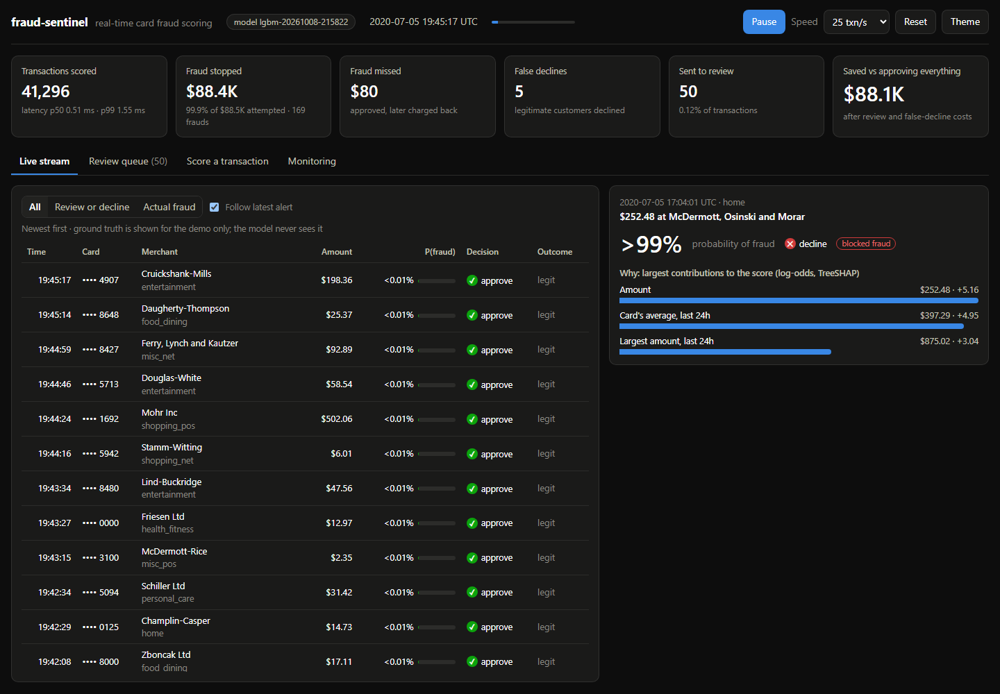
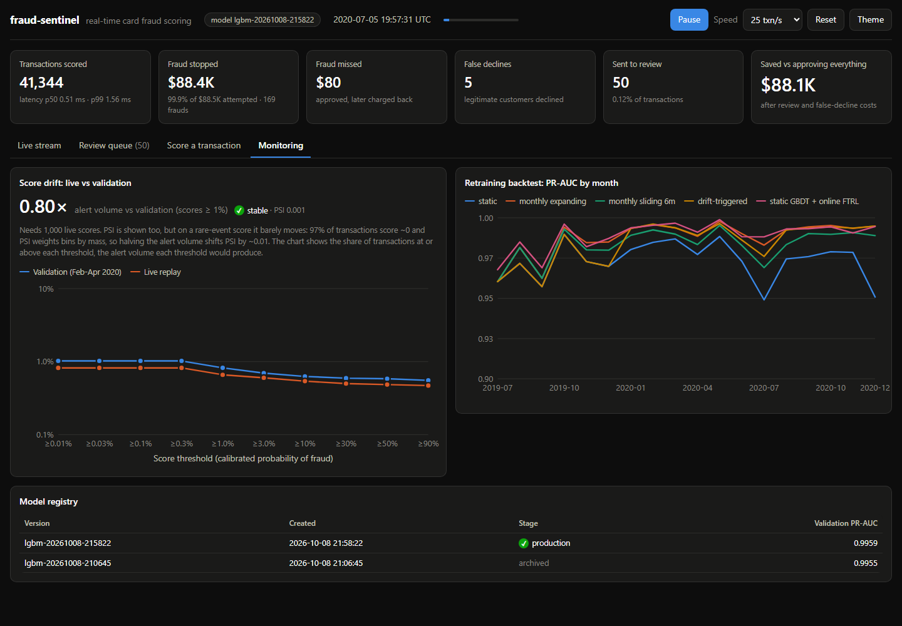

# fraud-sentinel

Real-time card fraud detection, built end to end without shortcuts:

- **PostgreSQL system of record** with labels modelled as *delayed chargeback events*, never as a column you can peek at.
- **One feature definition, two engines.** Every feature compiles to a PostgreSQL window query (training) and to a streaming state machine (serving). They are verified equal on all 1.85M transactions.
- **Hand-written streaming data structures:** sliding-window deques, a monotonic deque, LRU, Count-Min Sketch, Bloom filter, a top-k heap and Welford variance, all property-tested.
- **Models from scratch:** Newton/IRLS logistic regression, FTRL-Proximal, and histogram gradient boosting with second-order splits, missing-value routing and focal loss. Tested against scikit-learn and LightGBM.
- **Decisions in dollars:** calibrated probabilities feed a cost model (approve / review / decline), daily analyst capacity and conformal guarantees.
- **Production loop:** a FastAPI scorer with reason codes and async prediction logging, a model registry, label-free drift monitoring, an 18-month retraining backtest and a live dashboard.



## Results

Sparkov credit-card transactions: 1.85M transactions, 999 cards, 2019-2020. Models train on Jan 2019 - Jan 2020 with labels *as known on deploy day*, then are evaluated on Jun 21 - Dec 31 2020 (556k transactions, 2,145 frauds) against ground truth. Intervals are 95% card-level cluster bootstrap. Each row below links to the report that produced it.

**Models** ([model_comparison](reports/model_comparison.md), [tuning](reports/tuning.md))

| Model | PR-AUC | Recall @ 0.5% alert rate |
|---|---|---|
| Rules (amount x night) | 0.246 (0.218-0.270) | 0.415 |
| Logistic regression, from scratch (IRLS) | 0.836 (0.815-0.857) | 0.830 |
| Gradient boosting, from scratch | 0.989 (0.985-0.992) | 0.988 |
| LightGBM (defaults) | 0.990 (0.987-0.994) | 0.988 |
| LightGBM, tuned on rolling-origin CV | 0.992 (0.988-0.994) | 0.990 |
| LightGBM without card history features | 0.879 (0.860-0.898) | 0.855 |

The point-in-time card features are worth +0.11 PR-AUC. The scratch GBDT is 0.0017 PR-AUC behind LightGBM (paired bootstrap, interval excludes 0) with identical recall.

**Decisions in dollars** ([decisions](reports/decisions.md); LightGBM with default parameters, isotonic-calibrated on the validation period)

| Policy | Total cost on the test period |
|---|---|
| Approve everything | $1,133,325 |
| Decline above the best-F1 threshold | $31,860 |
| Expected-cost (Bayes) policy on class-weighted, uncalibrated scores | $13,376 |
| **Expected-cost policy on calibrated scores** | **$7,145** (4,199-10,603) |
| Same, with at most 4 analyst reviews per day | $7,204 |

Calibration halves the cost of the same model; pricing each decision by amount beats the F1 threshold by 4.5x. Conformal prediction sets kept auto-approved fraud at 1.6% against a 5% guarantee.

**Production checks** ([parity](reports/parity.md), [replay](reports/replay.md), [backtest](reports/backtest.md), [sketches](reports/sketches.md))

- SQL and streaming features: identical on all 26 aggregates x 1.85M transactions.
- Online replay of the whole test period: every served probability equals the offline one (max difference 0.0), p50 0.47 ms / p99 1.05 ms per transaction in-process (1.9 / 2.8 ms over HTTP), all 555,719 predictions logged to PostgreSQL.
- Retraining, 18 months: static model 0.973 mean monthly PR-AUC; monthly retraining 0.988 (17 retrains); drift-triggered 0.985 (3 retrains); frozen GBDT leaves + online FTRL 0.989 (0 retrains).
- First-time card-merchant detection: a 0.63 MB Bloom filter catches 99.8% of first-time pairs vs a 65 MB exact table; the best Count-Min Sketch needs 11 MB to reach 85%.

**Caveat.** Sparkov is synthetic, and its fraud is easier to separate than real fraud, so absolute scores are optimistic. The point of the project is the machinery around the model: point-in-time features, delayed labels, calibration, decisions, parity and monitoring.

## Architecture

```mermaid
flowchart LR
    subgraph Offline
        CSV[(Kaggle CSVs)] --> ING[ingest + chargeback simulator]
        ING --> PG[(PostgreSQL<br/>customers / merchants<br/>transactions (monthly partitions)<br/>chargebacks / ground_truth)]
        SPEC[[FeatureSpec]] --> SQLC[SQL compiler]
        SQLC --> PG
        PG --> OFF[(offline feature table<br/>versioned by spec hash)]
        OFF --> TRAIN[train + calibrate<br/>time-series CV]
        TRAIN --> REG[(model_registry)]
    end
    subgraph Online
        REQ([authorization]) --> ENG[streaming feature engine<br/>deques / LRU state]
        SPEC --> ENG
        ENG --> MDL[LightGBM + isotonic]
        REG --> MDL
        MDL --> POL[cost-based policy]
        POL --> RESP([approve / review / decline<br/>+ reason codes])
        POL -. async batch .-> LOG[(predictions)]
        CB([chargeback]) --> ENG
    end
    OFF <-. parity test: identical on 1.85M rows .-> ENG
```

## Quickstart

Requirements: Python 3.12 with [uv](https://docs.astral.sh/uv/), PostgreSQL 14+ (or `docker compose up db`), and a Kaggle API token.

```bash
uv sync
kaggle datasets download kartik2112/fraud-detection --unzip -p data/raw/sparkov
export SENTINEL_DB_URL=postgresql://postgres@localhost:5432/sentinel   # default

uv run sentinel ingest      # normalize CSVs into PostgreSQL, simulate chargeback delays
uv run sentinel features    # build the offline feature table with SQL window functions
uv run sentinel parity      # replay all events through the streaming engine and diff
uv run sentinel compare     # rules vs scratch LR vs scratch GBDT vs LightGBM + ablation
uv run sentinel imbalance   # class weights, undersampling, SMOTE, focal loss
uv run sentinel tune        # Optuna with rolling-origin CV
uv run sentinel decisions   # policies costed in dollars, conformal check, segment audit
uv run sentinel train       # train, calibrate, register the production model
uv run sentinel replay --http 2000   # stream the test period through the online scorer
uv run sentinel backtest    # 18 months of retraining policies
uv run sentinel serve       # http://127.0.0.1:8000/docs

uv run pytest               # unit + property tests; PostgreSQL tests run when a DB is reachable
```

`sentinel serve` also serves the dashboard at http://127.0.0.1:8000/. It replays the deployment period through the live scorer, and has a decision inspector, a manual scoring form, the analyst review queue and monitoring. Use `--no-demo` for the API only.



Example requests against a freshly started server (its online state is warmed up to 2020-06-21 12:14 UTC, and events must arrive in time order):

```bash
# a $64 grocery purchase near home in the afternoon -> approve
curl -s localhost:8000/v1/score -H 'content-type: application/json' -d '{
  "txn_id": "6c3f0a3a5b0c4d2e9f1a2b3c4d5e6f70", "ts": "2020-06-21T13:00:00Z",
  "card_id": 4613314721966, "merchant_id": 412, "category": "grocery_pos",
  "amount": 64.20, "merch_lat": 35.9, "merch_lon": -81.6}'

# the same card, $1,020 online at 02:30 -> review
curl -s localhost:8000/v1/score -H 'content-type: application/json' -d '{
  "txn_id": "6c3f0a3a5b0c4d2e9f1a2b3c4d5e6f71", "ts": "2020-06-22T02:30:00Z",
  "card_id": 4613314721966, "merchant_id": 412, "category": "shopping_net",
  "amount": 1020.15, "merch_lat": 40.2, "merch_lon": -78.4}'
```

```json
{
  "txn_id": "6c3f0a3a-5b0c-4d2e-9f1a-2b3c4d5e6f71",
  "p_fraud": 0.0339,
  "decision": "review",
  "reasons": [
    {"feature": "amount", "value": 1020.15, "contribution": 6.99},
    {"feature": "hour", "value": 2.0, "contribution": 1.56},
    {"feature": "amount_to_card_category_mean", "value": 8.26, "contribution": 1.37}
  ],
  "model_version": "lgbm-20261008-215822",
  "latency_ms": 1.1,
  "duplicate": false
}
```

Sending the same `txn_id` again (a network retry) returns the same decision with `"duplicate": true` and does not count the transaction twice in the card's velocity features.

## Repository layout

```
sql/schema.sql                 normalized schema, partitions, registry, prediction log
src/sentinel/
  data/                        ingestion, chargeback simulation, point-in-time splits
  ds/                          sliding windows, LRU, Count-Min Sketch, top-k, Welford
  features/                    FeatureSpec, SQL compiler, streaming engine, row features
  models/scratch/              IRLS + FTRL logistic regression, histogram GBDT
  models/                      losses, calibration, imbalance tools, model wrappers
  eval/                        metrics (from scratch), card-level cluster bootstrap
  decision.py                  cost model, capacity-constrained and conformal policies
  monitoring/                  PSI, KS, adversarial validation
  experiments/                 every report in reports/ is generated by one of these
  serve/                       bundle + registry, scorer, FastAPI app, replay harness
tests/                         property, parity, leakage and API tests
reports/                       generated results (markdown)
```

## Further reading

- [DESIGN.md](DESIGN.md): decisions, trade-offs and what changes at scale
- [MODEL_CARD.md](MODEL_CARD.md): intended use, data, evaluation and limitations
